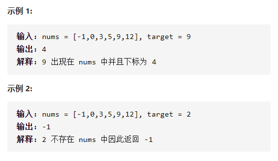
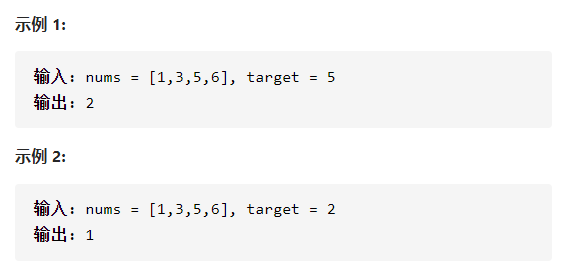
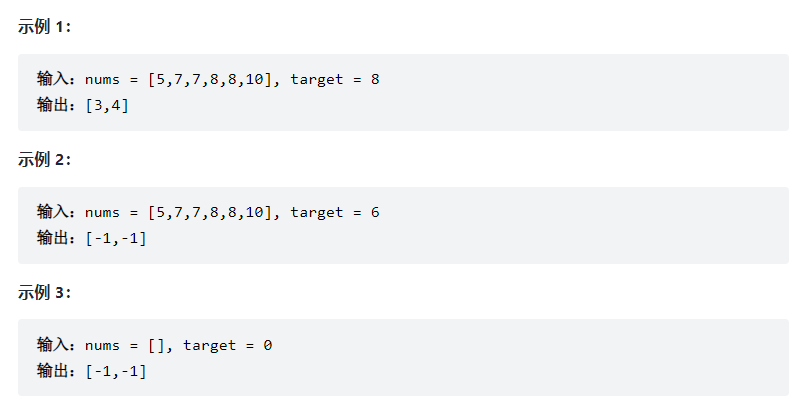
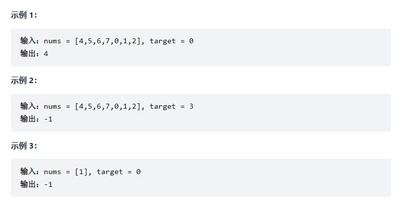
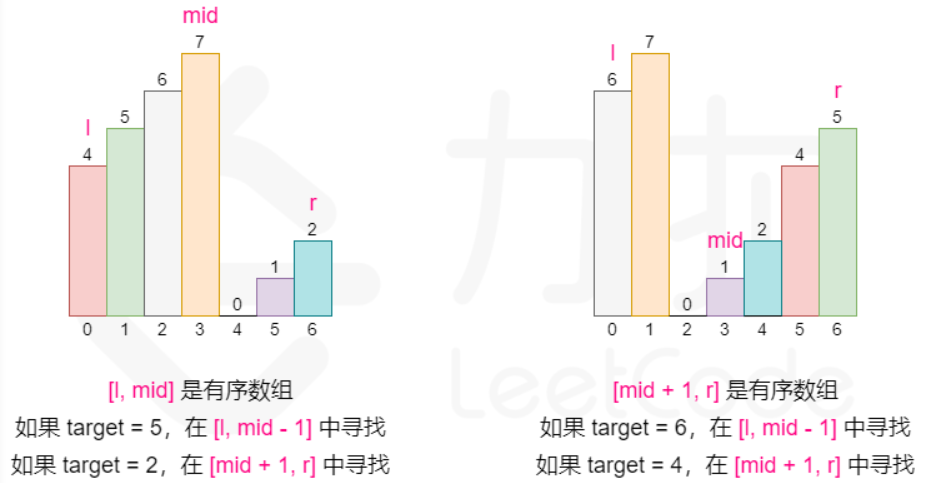

## 二分查找

### [704.二分查找](https://leetcode-cn.com/problems/binary-search/)

【题目描述】：

​		给定一个 n 个元素有序的（升序）整型数组 nums 和一个目标值 target  ，写一个函数搜索 nums 中的 target，如果目标值存在返回下标，否则返回 -1。

【解题思路】：

​		二分查找通常用于升序(降序)数组中，采用比较目标值和数组的中间元素的思路。

- 如果目标值等于中间元素，则找到目标值；
- 如果目标值较小，则在左区间进行搜索；
- 如果目标值较大，则在右区间进行搜索。

【代码】：

~~~java
class Solution {
    public int search(int[] nums, int target) {
        int left = 0, right = nums.length-1, ans = -1;
        while(left <= right){
            int mid = (left + right) / 2;
            if(target == nums[mid]){
                ans = mid;
                break;
            }
            if(target > nums[mid]){
                left = mid + 1;
            }
            else{
                right = mid - 1;
            }
        }
        return ans;
    }
}
~~~

### [35. 搜索插入位置](https://leetcode-cn.com/problems/search-insert-position/)

【题目描述】：

​		给定一个排序数组和一个目标值，在数组中找到目标值，并返回其索引。如果目标值不存在于数组中，返回它将会被按顺序插入的位置。

【解题思路】：

​		该题目要在排序数组中查找/插入一个目标值。对于有序数组中的元素查找，二分法可以在O(logn)时间内完成，其成立条件为：**target = nums[pos]**。而对于不存在于数组中的目标值，需要将其插入数组中合适的位置上，同样可以通过二分法进行位置的查找，其成立条件为：**nums[pos-1] < target < nus[pos]**。

​		因此综合而言，该题目可以通过二分法进行查找，且最终的位置pos满足条件：

nums[pos-1] < target <= nums[pos]</cenetr>

【代码】：

~~~java
class Solution {
    public int searchInsert(int[] nums, int target) {
        int n = nums.length;
        int left = 0, right = n-1;
        //边界条件，定义为闭区间
        while(left<=right){
            int mid = (left+right) / 2;
            //target大于mid，在右区间
            if(target > nums[mid]){
                left = mid+1;
            }
            //target小于或等于mid，在左区间
            else{
                right = mid-1;
            }
        }
        return left;
    }
}
~~~

### [34.在排序数组中查找元素的第一个和最后一个位置](https://leetcode-cn.com/problems/find-first-and-last-position-of-element-in-sorted-array/)

【题目描述】：

​		给定一个按照升序排列的整数数组 nums，和一个目标值 target。找出给定目标值在数组中的开始位置和结束位置。

​		如果数组中不存在目标值 target，返回 [-1, -1]。

【解题思路】：

​		由于数组是单调非递减的，可以通过二分查找分别找到target的开始位置和结束位置。

- 第一次二分查找第一个`>=target`的位置，区间划分应为`[l, mid]`和`[mid+1, r]`，其更新操作为`r = mid`和`l = mid+1`；
- 第二次二分查找最后一个`<=target`的位置，区间应划分为`[l, mid+1]`和`[mid, r]`，其更新操作为`l = mid`和`r = mid-1`；

​		需要注意的是，当我们更新区间时，如果左边界l更新为`l = mid`，此时mid的取值就应为`mid = (l + r + 1)/ 2`。因为当右边界`r = l + 1`时，此时`mid = (l + l + 1)/2`，相当于下取整，mid为l，左边界再次更新为l = mid = l，相当于没有变化。while循环就会陷入死循环。因此，我们总结出来一个小技巧，当左边界要更新为l = mid时，我们就令 `mid =(l + r + 1)/2`，相当于上取整，此时就不会因为r取特殊值 r = l + 1而陷入死循环了。

【代码】：

~~~java
class Solution {
    public int[] searchRange(int[] nums, int target) {
        //查找第一个元素
        int l = 0, r = nums.length-1;
        while(l < r){
            int mid = (l + r) / 2;
            if(nums[mid] >= target) r = mid;
            else    l = mid + 1;
        }
        int res1 = l;
        
        //查找最后一个元素
        l = 0; r = nums.length-1;
        while(l < r){
            int mid = (l + r + 1) / 2;
            if(nums[mid] <= target) l = mid;
            else    r = mid - 1;
        }
        int res2 = l;
        
        //判断查找结果是否符合要求
        if(res2 <= nums.length-1 && nums[res1] == target && nums[res2] == target){
            return new int[]{res1, res2};
        }
        else{
            return new int[]{-1, -1};
        }
    }
}
~~~

### [33.搜索旋转排序数组](https://leetcode-cn.com/problems/search-in-rotated-sorted-array/)

【题目描述】：

​		整数数组 nums 按升序排列，数组中的值 互不相同 。

​		在传递给函数之前，nums 在预先未知的某个下标 k（0 <= k < nums.length）上进行了 旋转，使数组变为 [nums[k], nums[k+1], ..., nums[n-1], nums[0], nums[1], ..., nums[k-1]]（下标 从 0 开始 计数）。例如， [0,1,2,4,5,6,7] 在下标 3 处经旋转后可能变为 [4,5,6,7,0,1,2] 。

​		给你旋转后的数组 nums 和一个整数 target ，如果 nums 中存在这个目标值 target ，则返回它的下标，否则返回 -1 。

【解题思路】：

​		对于有序数组，一般可以采用二分查找的方式查找元素。而在本题中，数组经过旋转只保证了数组的局部是有序的。可以发现，将数组从某个位置分成左右两部分的时候，一定有一部分是有序的。因此我们可以在进行二分查找时观察哪个部分是有序的，并根据有序的部分进行上下界的更改。

- 如果`nums[mid]=target`，则查询结束，返回`mid`值；
- 如果`[l, mid-1]`是有序数组，
  - 如果target在`{nums[l], nums[mid]}`范围内，则范围缩小为`[l, mid-1]`，应将r更新为`mid-1`；
  - 否则，范围缩小为`[mid+1, r]`，应将l更新为`mid+1`；
- 如果`[mid+1, r]`是有序数组，
  - 如果target在`{nums[mid], nums[r]}`范围内，则范围缩小为`[mid+1, r]`，应将l更新为`mid+1`；
  - 否则，范围应缩小至`[l, mid-1]`，应将r更新为`mid-1`；

【代码】：

~~~java
class Solution {
    public int search(int[] nums, int target) {
        int left = 0, right = nums.length-1;
        int ans = -1;
        //边界处理
        if(nums.length == 1){
            return nums[0] == target ? 0 : -1;
        }
        while(left <= right){
            int mid = (left + right) / 2;
            if(nums[mid] == target) return mid;
            
            //前半部分递增
            if(nums[mid] >= nums[left]){
                if(nums[left] <= target && nums[mid] >= target){
                    right = mid - 1;
                }else{
                    left = mid + 1;
                }
            }
            
            //后半部分递增
            if(nums[mid] <= nums[right]){
                if(nums[mid] <= target && nums[right] >= target){
                    left = mid + 1;
                }else{
                    right = mid - 1;
                }
            }
        }
        return ans;
    }
}
~~~

