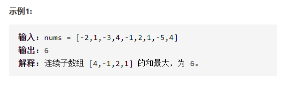
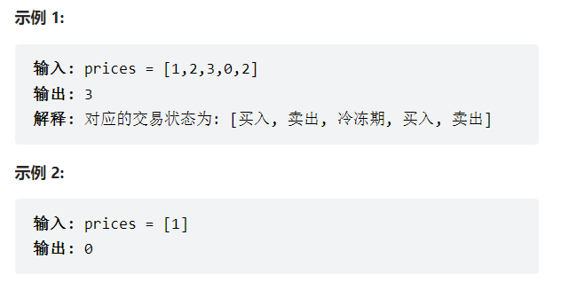
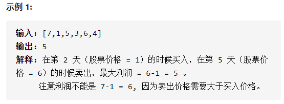
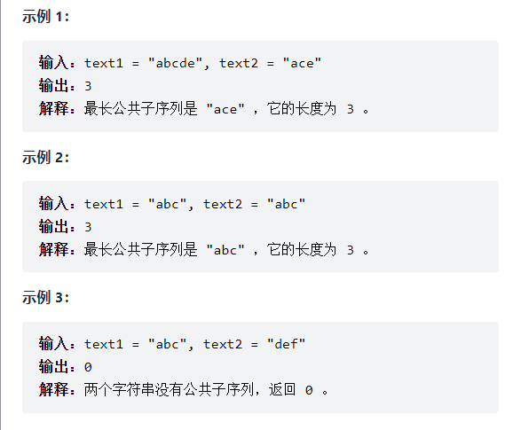
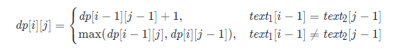
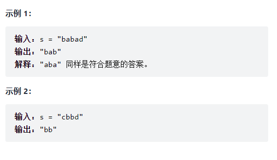

## 动态规划

### 一维

#### 剑指offer 42.连续子数组最大和

【题目描述】：

​		输入一个整型数组，数组中的一个或连续多个整数组成一个子数组。求所有子数组的和的最大值。要求时间复杂度为O(n)。

【思路】：

- 状态定义：设动态规划表dp，dp[i]代表以元素nums[i]为结尾元素的连续子数组最大和。
- 转移方程：
  - 当$dp[i-1] > 0$时，执行$dp[i] = dp[i-1] + nums[i]$；
  - 当$dp[i-1] \leq 0$时，执行$dp[i] = nums[i]$；

- 初始状态：$dp[0] = nums[0]$；
- 返回值：返回dp列表中的最大值，即为全局最大值。

**空间复杂度降低：**

​		由于`dp[i]`只与`dp[i-1]`和`nums[i]`有关系，因此可将原数组`nums`作为dp列表，直接在`nums`上修改。并设置全局变量，在遍历数组时保存最大值。可以使空间复杂度从$O(n)$降至$O(1)$。

【代码】：

~~~java
class Solution {
    public int maxSubArray(int[] nums) {
        int res = nums[0];
        for(int i = 1; i < nums.length; i++) {
            nums[i] += Math.max(nums[i - 1], 0);
            res = Math.max(res, nums[i]);
        }
        return res;
    }
}
~~~

#### 305. 最佳买卖股票时机（含冷冻期）

【题目描述】：

​		给定一个整数数组prices，其中第  prices[i] 表示第 i 天的股票价格 。

​		设计一个算法计算出最大利润。在满足以下约束条件下，你可以尽可能地完成更多的交易（多次买卖一支股票）:

​		卖出股票后，你无法在第二天买入股票 (即冷冻期为 1 天)。
​		注意：你不能同时参与多笔交易（你必须在再次购买前出售掉之前的股票）。

【思路】：

​		该题目在股票买卖的基础上加入了冷冻期，即卖出后的第二天无法继续买入股票，因此在一天下，可能会产生以下3种情况：

- 当天结束时持有股票——`dp[i][0]`；
- 当天结束时不持有股票，且处于冷冻期，即当天卖出股票——`dp[i][1]`；
- 当天结束时不持有股票，且不处于冷冻期，即当天之前卖出股票——`dp[i][2]`；

​		因此在进行动态规划时，我们需要对这3种情况同时进行考虑。

- `dp[i][0]`：在第i天持有股票，该股票可能是在之前或者当天购买，包含两种情况，
  - 前i-1天中购买，`dp[i-1][0]`；
  - 第i天购买，第i-1天未持有股票且不处于冷冻期：`dp[i-1][2] - prices[i]`；
- `dp[i][1]`：当天卖出股票，`dp[i-1][0] + prices[i]`；
- `dp[i][2]`：在i-1天已卖出股票，且当日未进行买入，共有两种情况，
  - `dp[i-1][1]`；
  - `dp[i-1][2]`；

​		由此可以得到**状态转移方程**：
$$
\begin{cases}
dp[i][0] = max(dp[i-1][0], dp[i-1][2] - prices[i]) \\
dp[i][1] = dp[i-1][0] + prices[i]\\
dp[i][2] = max(dp[i-1][1], dp[i-2][2])
\end{cases}
$$
​		状态初始化为：
$$
\begin{cases}
dp[0][0] = -prices[0]\\
dp[0][1] = 0	\\
dp[0][2] = 0	\\
\end{cases}
$$
​		最后返回第n天中，三个状态的最大值即为最大利润。

**空间优化**

​		可以发现第`i`天的状态只与第`i-1`天有关，因此只需要用三个变量保存第`i-1`天的状态，即可将空间复杂度从O(n)优化到O(1)。

【代码】：

~~~java
class Solution {
    public int maxProfit(int[] prices) {
        int n = prices.length;
        //dp[i][0]:当前持有股票
        //dp[i][1]:当前不持有股票，并处于冷冻期
        //dp[i][2]:当前不持有股票，并未处于冷冻期
        int[][] dp = new int[n][3];
        //Initialize
        dp[0][0] = -prices[0];
        //Dynamic Programming
        for(int i = 1; i < n; i++){
            dp[i][0] = Math.max(dp[i-1][0], dp[i-1][2] - prices[i]);
            dp[i][1] = dp[i-1][0] + prices[i];
            dp[i][2] = Math.max(dp[i-1][1], dp[i-1][2]);
        }
        return Math.max(dp[n-1][0], Math.max(dp[n-1][1], dp[n-1][2]));
    }
}
~~~

#### 剑指offer 63. 股票的最大利润

【题目描述】：		

​		假设把某股票的价格按照时间先后顺序存储在数组中，请问买卖该股票一次可能获得的最大利润是多少？

【思路】：

​		最直接的思路是采用暴力的方法遍历，以每一天的价格作为买入时间，计算其可能获得的最大收益，最后取最大值，即$max(prices[j] - prices[i])$（i<j)，时间复杂度为$O(n^2)$。

​		进一步优化，我们希望只对数组进行一次遍历得到结果，可以采取动态规划的思路。

- 状态定义：设动态规划表dp，dp[i]代表前i天的最大收益。
- 转移方程：$dp[i] = max(dp[i-1], prices[i] - minprice)$，其中minprice为前i天的最小买入价格；

- 初始状态：$dp[0] = 0$，minprice = Integer.MAX_VALUE；
- 返回值：返回dp列表中的最大值，即为全局最大值。

**空间复杂度降低：**

​		可以设置一个值maxprice作为返回值，保存每一天为止的最大收益。

【代码】：

~~~java
class Solution {
    public int maxProfit(int[] prices) {
        //maxprofit:最大收益, minprice:最小买入
        int maxprofit = 0, minprice = Integer.MAX_VALUE;
        for(int i=0; i<prices.length; i++){
            minprice = Math.min(minprice, prices[i]);
            maxprofit = Math.max(maxprofit, prices[i]-minprice);
        }
        return maxprofit;
    }
}
~~~

### 二维

#### [1143. 最长公共子序列]()

​		给定两个字符串 text1 和 text2，返回这两个字符串的最长 公共子序列 的长度。如果不存在 公共子序列 ，返回 0 。

​		一个字符串的 子序列 是指这样一个新的字符串：它是由原字符串在不改变字符的相对顺序的情况下删除某些字符（也可以不删除任何字符）后组成的新字符串。

​		例如，"ace" 是 "abcde" 的子序列，但 "aec" 不是 "abcde" 的子序列。两个字符串的 公共子序列 是这两个字符串所共同拥有的子序列。

【思路】：

​		该题目是一个二位动态规划的问题。假设`text1`的长度为`m`，`text2`的长度为`n`，创建一个二维数组`dp[m+1][n+1]`来维护动态规划的状态，其中`dp[i][j]`表示`text1[0:i]`和`text2[0:j]`的最长公共子序列的长度。

​		首先，考虑动态规划的边界情况：

- 当$i=0$时，`text1[0:i]`为空，因此对任意`j`，`dp[0][j]`为0；

- 当$j=0$时，`text2[0:j]`为空，因此对任意`i`，`dp[i][0]`为0；

  因此动态规划的边界条件是：`dp[0][0] = 0`。

​		之后考虑当`i>0`且`j>0`时，dp的状态转移方程：

- 当`text1[i] = text2[j]`时，将这两个字符称为公共字符，考虑`text1[0:i-1]`和`text2[0:j-1]`的最长公共子序列，只需再增加一个字符就可以得到`text1[0:i]`和`text2[0:j]`的最长公共子序列，因此`dp[i][j] = dp[i-1][j-1] + 1`。

- 当`text1[i] != text2[j]`时，考虑以下两项：

  - `text1[0:i-1]`和`text2[0:j]`的最长公共子序列；
  - `text1[0:i]`和`text2[0:j-1]`的最长公共子序列；

  要得到`text1[0:i]`和`text2[0:j]`的最长公共子序列，应取两项中长度较大的一项，因此`dp[i][j] = max(dp[i-1][j], dp[i][j-1])`。

​		由此可以得到状态转移方程：

​		最终得到`dp[m][n]`即为最长公共子序列的长度。

【代码】：

~~~java
class Solution {
    public int longestCommonSubsequence(String text1, String text2) {
        int m = text1.length(), n = text2.length();
        int[][] dp = new int[m + 1][n + 1];
        //dp[i][0]和dp[0][j]初始化为0，从i=1开始遍历
        for(int i = 1; i <= m; i++){
            char c1 = text1.charAt(i - 1);
            for(int j = 1; j <= n; j++){
                char c2 = text2.charAt(j - 1);
                //状态转移
                if(c1 == c2){
                    dp[i][j] = dp[i-1][j-1] + 1;
                }else{
                    dp[i][j] = Math.max(dp[i-1][j], dp[i][j-1]);
                }
            }
        }
        return dp[m][n];
    }
}
~~~

#### [5.最长回文字串]()

【题目描述】：

​		给你一个字符串`s`， 找到`s`的最长回文子串。

【思路】：

​			对于一个子串而言，如果它是回文串，并且长度大于 22，那么将它首尾的两个字母去除之后，它仍然是个回文串。例如对于字符串 `ababa`，如果我们已经知道 `bab` 是回文串，那么`ababa`一定是回文串，这是因为它的首尾两个字母都是 `a`。

​		根据这样的思路，可以通过动态规划来解决此问题。用$P(i, j)$表示字符串s的第$i$到$j$个字母组成的串（s[i, j]）是否为回文串。
$$
P(i, j) = \begin{cases}
true, 如果s[i, j]是回文子串 \\
false, 其他情况	\\
\end{cases}
$$
其他情况包含两种可能性：

- s[i, j]本身不是一个回文串；
- i>j, 此时s[i, j]不合法；

​		因此，可以写出啊动态规划的状态转移方程：
$$
P(i, j) = P(i+1, j-1) || (s_i == s_j)
$$
​		以上的转移方程是建立在子串的长度大于2的前提上的，此外，我们还需要考虑动态规划的边界条件，即子串的长度为1或2。

- 长度为1的子串，显然为回文串；
- 长度为2的子串，当两个字符相同时，它就是一个回文串；

​	因此可以得到边界条件：
$$
\begin{cases}
P(i, i) = True;	\\
P(i, i+1) = (S_i == S_{i+1}) \\
\end{cases}
$$
​		根据这个思路，就可以完成动态规划。此外，需要一个变量`maxLen`储存最大字串长度，`begin`变量储存最长字串开始的位置，每当最大长度发生改变时，对这两个变量进行更新，方便最后最长字串的返回。

【代码】：

~~~java
class Solution {
    public String longestPalindrome(String s) {
       int len = s.length();
       if(len < 2){
           return s;
       }

       //maxLen-最长字串长度，begin-最长字串开始位置
       int maxLen = 1, begin = 0;
       //dp[i][j]表示s[i...j]是否为回文子串
       boolean[][] dp = new boolean[len][len];
       //边界条件len = 1, 初始化
       for(int i = 0; i < len; i++){
           dp[i][i] = true;
       }
       char[] charArray = s.toCharArray();
       //递推开始，先枚举字串长度（注意边界值）
       for(int L = 2; L <= len; L++){
           //枚举左边界
           for(int i = 0; i < len; i++){
               //由L和i确定右边界
               int j = L + i - 1;
               if(j >= len){
                   break;
               }

               if(charArray[i] != charArray[j]){
                   dp[i][j] = false;
               }else{
                   //字串长度为2，边界处理
                   if(j - i < 3){
                       dp[i][j] = true;
                   }else{
                       dp[i][j] = dp[i + 1][j - 1];
                   }
               }
               if(dp[i][j] && j - i + 1 > maxLen){
                    maxLen = j - i + 1;
                    begin = i;
                }
           }
       }
       return s.substring(begin, begin + maxLen);
    }
}
~~~

