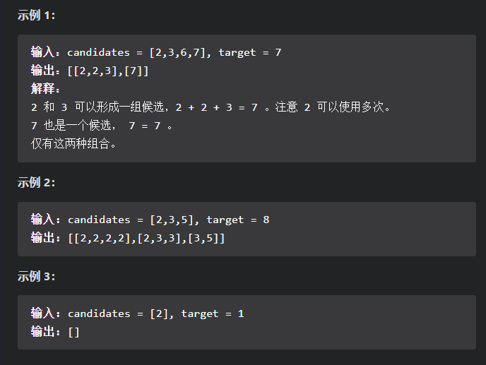
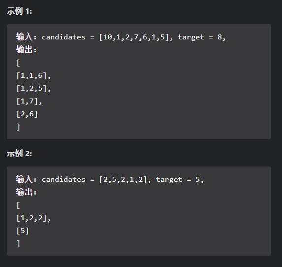
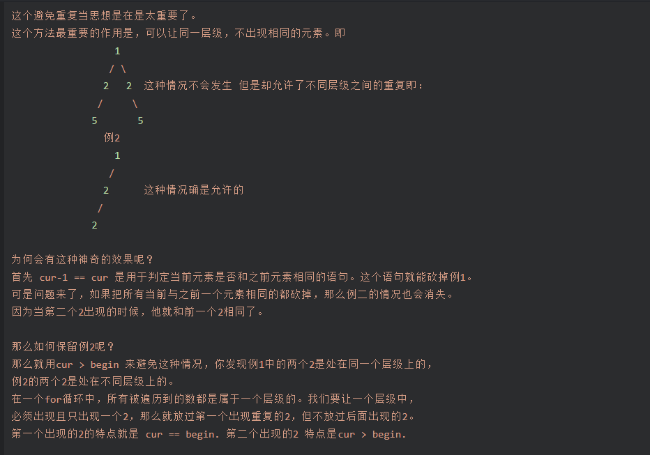

## 回溯

#### [39. 组合总和](https://leetcode-cn.com/problems/combination-sum/)

​		给你一个 无重复元素 的整数数组 candidates 和一个目标整数 target ，找出 candidates 中可以使数字和为目标数 target 的所有不同组合 ，并以列表形式返回。你可以按任意顺序返回这些组合。

​		candidates 中的 同一个 数字可以 无限制重复被选取 。如果至少一个数字的被选数量不同，则两种组合是不同的。 

​		对于给定的输入，保证和为 target 的不同组合数少于 150 个。

【思路】：

​		题目要求找出所有的组合，显然是一道搜索+回溯的题目。

​		回溯问题的核心代码主要为以下3行：

~~~java
//添加搜索路径节点
path.add(candidates[i]);
//搜索函数
backtrack(candidates, target - candidates[i], path, i);
//路径回溯
path.remove(path.size() - 1);
~~~

​		此外，题目中的数组是无序的，为了更好地进行剪枝操作，需要将数组进行排序，这样在搜索进行到数组中某个位置，当前路径和大于`target`时，可以直接剪去数组之后的部分，避免多余的遍历。

【代码】：

~~~java
class Solution {
    List<List<Integer>> ans;
    public List<List<Integer>> combinationSum(int[] candidates, int target) {
        ans = new ArrayList<>();
        Arrays.sort(candidates);
        backtrack(candidates, target, new ArrayList<>(), 0);
        return ans;
    }
    
    //回溯搜索
    private void backtrack(int[] candidates, int target, List<Integer> path, int start){
        //剪枝
        if(target == 0){
            ans.add(new ArrayList<>(path));
            return;
        }
        //除去相同元素
        for(int i = start; i < candidates.length; i++){
            if(candidates[i] > target){
                return;
            }

            if(i > start && candidates[i] == candidates[i-1]){
                continue;
            }
            //添加搜索路径
            path.add(candidates[i]);
            //顺着路径进行搜索
            backtrack(candidates, target - candidates[i], path, i);
            //路径回溯
            path.remove(path.size() - 1);
        }
    }
}

~~~

#### [40. 组合总和II](https://leetcode-cn.com/problems/combination-sum-ii/)

​		给定一个候选人编号的集合 candidates 和一个目标数 target ，找出 candidates 中所有可以使数字和为 target 的组合。

​		candidates 中的每个数字在每个组合中只能使用 一次 。

​		注意：解集不能包含重复的组合。 

【思路】：

​		该题与<u>39.组合总和</u>相像，其区别是在此题中，candidate中的每个元素只能使用一次。由于增加了该条件的限制，本题需要在39题的基础上进一步进行剪枝的操作。

​		题解参考：https://leetcode-cn.com/problems/combination-sum-ii/solution/hui-su-suan-fa-jian-zhi-python-dai-ma-java-dai-m-3/

​		与39题的基本思路一样，需要先对candidates数组进行排序，这样可以保证搜索是按照固定的顺序进行的，这样可以方便之后的剪枝操作。

- 大剪枝，也就是搜索到`target<0`，进一步的搜索已经无法找到合适的子数组，需要将当前以及后面的节点进行剪枝操作，继续进行下一个结点的搜索；

- 小剪枝，则是避免搜索到重复结点的分支，将重复的子数组剪去，这也是该题代码中的核心部分；

  ~~~java
  if(cur > begin && candidates[cur] = candidates[cur-1]);
  ~~~

  具体参考@Allan的解释，十分清楚：

  

【代码】：

~~~Java
class Solution {
    List<List<Integer>> ans;
    public List<List<Integer>> combinationSum2(int[] candidates, int target) {
        ans = new ArrayList<>();
        //对数组排序，便于后面的搜索与剪枝
        Arrays.sort(candidates);
        //开始搜索
        backtrack(candidates, target, new ArrayList<>(), 0);
        return ans;
    }

    private void backtrack(int[] candidates, int target, List<Integer> path, int start){
        //递归到叶子节点，且路径和为0，找到结果
        if(target == 0){
            ans.add(new ArrayList<>(path));
            return;
        }
        for(int i = start; i < candidates.length; i++){
            //大剪枝，当前元素大于目标元素，则不需要再对后面元素进行遍历
            if(target - candidates[i] < 0){
                return;
            }
            //小剪枝，剪去位于同层的相同元素
            //原因在有序的情况下，后面出现的元素都相同，会产生相同他的结果
            //i > start的目的是保留不在同层的相同元素
            if(i > start && candidates[i] == candidates[i-1]){
                continue;
            }
            //将数组元素加入path
            path.add(candidates[i]);
            //进行下一层的搜索
            backtrack(candidates, target - candidates[i], path, i+1);
            //剪枝
            path.remove(path.size() - 1);
        }
    }
}
~~~

