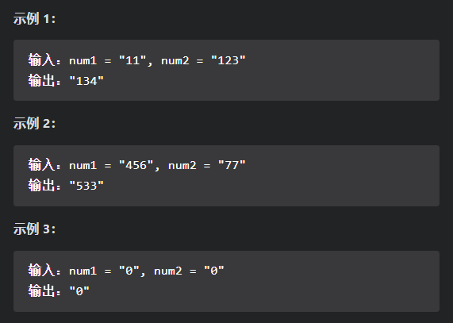
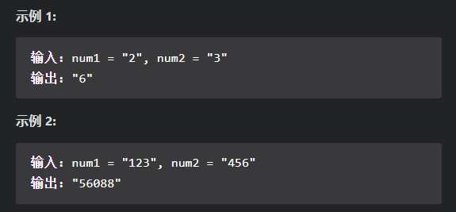
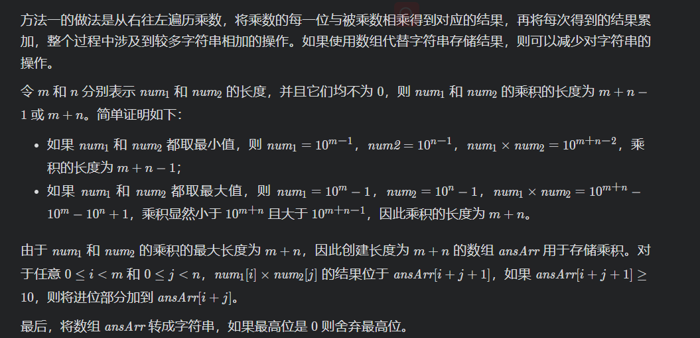
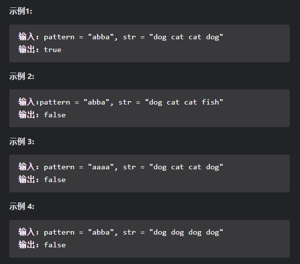

## 字符串

### [415. 字符串相加](https://leetcode-cn.com/problems/add-strings/)

【题目描述】：

​		给定两个字符串形式的非负整数 num1 和num2 ，计算它们的和并同样以字符串形式返回。

​		你不能使用任何內建的用于处理大整数的库（比如 BigInteger）， 也不能直接将输入的字符串转换为整数形式。

【思路】：

​		定义两个指针`m`合`n`分别指向两个数的末尾，并定义一个标记符`carry`记录当前位置是否需要进位。为了处理两个数位数不同的情况，统一在指针当前下标处于负数的时候返回 00，等价于**对位数较短的数字进行了补零操作**。

【代码】：

~~~Java
class Solution {
    public String addStrings(String num1, String num2) {
        int m = num1.length()-1, n = num2.length()-1;
        int carry = 0;

        StringBuffer ans = new StringBuffer("");

        while(m >= 0 || n >= 0 || carry != 0){
            int a = m >= 0 ? num1.charAt(m) - '0' : 0;
            int b = n >= 0 ? num2.charAt(n) - '0' : 0;
            int sum = a + b + carry;
            ans.append(sum % 10);
            carry = sum / 10;
            m -= 1; n -= 1;
        }
        ans.reverse();
        return ans.toString();
    }
}
~~~

### [43.字符串相乘](https://leetcode-cn.com/problems/multiply-strings/)

【题目描述】：

​		给定两个以字符串形式表示的非负整数 `num1` 和 `num2`，返回 `num1` 和 `num2` 的乘积，它们的乘积也表示为字符串形式。

【思路】：

- 模拟乘法，模拟乘法竖式，再对乘积统一求和，时间复杂度$O(mn)$​​；
- 优化版竖式，时间复杂度O(mn);

【代码】：

~~~java
class Solution {
    public String multiply(String num1, String num2) {
        if(num1.equals("0") || num2.equals("0")){
            return "0";
        }
        int m = num1.length(), n = num2.length();
        int[] ansArr = new int[m+n];
        //将每位乘积保存在对应的数组位置中
        for(int i = m-1; i >= 0; i--){
            int x = num1.charAt(i) - '0';
            for(int j = n-1; j >= 0; j--){
                int y = num2.charAt(j) - '0';
                int sum = ansArr[i + j + 1] + x * y;
                ansArr[i + j + 1] = sum % 10;
                ansArr[i + j] += sum / 10;                
            }
        }
        int index = ansArr[0] == 0 ? 1 : 0;
        StringBuffer ans = new StringBuffer();
        while(index < m + n){
            ans.append(ansArr[index]);
            index++;
        }
        return ans.toString();
    }
}
~~~

### [290.单词规律](https://leetcode-cn.com/problems/word-pattern/)

【题目描述】：

​		给定一种规律 pattern 和一个字符串 str ，判断 str 是否遵循相同的规律。

​		这里的 遵循 指完全匹配，例如， pattern 里的每个字母和字符串 str 中的每个非空单词之间存在着双向连接的对应规律。

【思路】：

​		题目中，需要判断字符与字符串之间是否一一对应，这是一种【双射】关系。我们需要建立一个哈希表`str2ch`记录每一个字符串对应的字符，和一个哈希表`ch2str`记录每一个字符对应的字符串。之后对哈希表进行配对的更新，如果产生冲突，则说明字符串和字符之间不满足双射关系。

【代码】：

~~~java
class Solution {
    public boolean wordPattern(String pattern, String s) {
        int n = s.length();

        Map<Character, String> ch2str = new HashMap<>();
        Map<String, Character> str2ch = new HashMap<>();
        int start = 0; //str中单词的指针

        for(int i = 0; i < pattern.length(); i++){
            if(start >= n)  return false;
            //截取单词
            int cur = start;
            while(cur < n && s.charAt(cur) != ' '){
                cur += 1;
            }
            String word = s.substring(start, cur);
            //判断是否满足双射
            char ch = pattern.charAt(i);
            if(str2ch.containsKey(word) && str2ch.get(word) != ch){
                return false;
            }
            if(ch2str.containsKey(ch) && !word.equals(ch2str.get(ch))){
                return false;
            }
            str2ch.put(word, ch);
            ch2str.put(ch, word);
            start = cur + 1;
        }
        return start >= n;
    }
}
~~~

