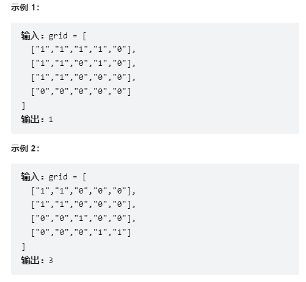

## 并查集

​		并查集是一种树状的数据结构，通常用于**元素分组**问题中，来处理一些不相交集合的**合并**以及**查询**操作。并查集支持两种操作：

- 查找(find)：确定某个元素处于哪个子集；
- 合并(union)：将两个子集合并成一个集合；

### 01. 基础

#### 初始化

​		对于1,...,n个元素，我们采用一个数组`fa[]`来储存每个元素的父节点，刚开始时将父节点设为自己。

~~~java
int[] fa = new int[n];
void init(int n){
    for(int i = 0; i < n; i++){
        fa[i] = i;
    }
    return;
}
~~~

#### 查询

​		采用递归对元素进行查询，一层一层访问父节点，直到到达根节点(根节点的父节点为其本身)，判断两个元素是否位于同一个集合，只需要判断其根节点是否相同。

~~~java
int find(int x){
    if(fa[x] == x){
        return x;
    }else{
        return find(fa[x]);
    }
}
~~~

#### 合并

​		将两个集合合并，先找到两个集合的代表元素，然后将一者的父节点设为另一者。

~~~java
void merge(int i, int j){
    fa[find(i)] = find(j);
}
~~~

### 02. 效率提升

#### 路径压缩

​		简单的并查集效率是比较低的，因为包括了太多的无用信息，使得查询时效率低下。对于一个集合内的元素，只需要知道其祖先是谁，便可判断其属于哪个集合。

​		因此我们采用路径压缩的方法，将路径上的每一个节点都直接连在根节点上。

~~~java
int find(int x){
    if(x == fa[x]){
        return x;
    }else{
        fa[x] = find(fa[x]);	//父节点设为根节点
        return fa[x];
    }
}
~~~

​		以上代码通常缩写成一行：

~~~java
int find(int x){
    return x == fa[x] ? x : (fa[x] = find(fa[x]));
}
~~~

​		路径压缩优化后，并查集的时间复杂度已经比较低了，绝大多数不相交集合的合并查询问题都能够解决。然而，对于某些时间卡得很紧的题目，我们还可以进一步优化。

#### 按秩合并

​		由于路径压缩只在查询时进行，并且只压缩一条路径，所以在合并时，并查集的结构仍可能十分复杂，如下例：

​		当我们在进行merge(7, 8)时，将8的父节点设为7是更好的操作，可以避免树的深度加深。

​		可以发现，对于两个需要合并的集合来说，如果我们将一棵深度较小的集合树连接到一棵更大的集合树下，显然相比于另一种连接方案，接下来执行查找操作的用时更小。实现时，使用一个数组`rank[]`记录每个根节点对应的树的深度(不是根节点，其rank相当于把它作为根节点的子树的深度)。一开始，把所有元素的rank设为1，合并时比较两个根节点，将rank较小者往较大者上合并。

**初始化(按秩合并)**

~~~java
void init(int n){
    for(int i = 0; i < n; i++){
        fa[i] = i;
        rank[i] = 1;
    }
}
~~~

**合并(按秩合并)**

~~~java
void merge(int i, int j){
    int x = find(i), y = find(j);
    if(rank[x] <= rank[y]){
        fa[x] = y;
    }else{
        fa[y] = x;
    }
    //深度相同，新的根节点深度要+1
    if(rank[x] == rank[y] && x != y){
        rank[y]++;
    }
}
~~~

### 03. 相关题目

#### 200.岛屿数量

【题目描述】：

​		给你一个由 '1'（陆地）和 '0'（水）组成的的二维网格，请你计算网格中岛屿的数量。岛屿总是被水包围，并且每座岛屿只能由水平方向和/或竖直方向上相邻的陆地连接形成。此外，你可以假设该网格的四条边均被水包围。

【思路】：

​		使用并查集将相邻的岛屿进行合并，最后剩余的集合数量即为岛屿数量。

~~~java
class Solution{
    class UnionFind{
        int count;
        int[] fa;
        int[] rank;

        public UnionFind(char[][] grid){
            count = 0;
            int m = grid.length, n = grid[0].length;
            fa = new int[m * n];
            rank = new int[m * n];
            for(int i = 0; i < m; i++){
                for(int j = 0; j < n; j++){
                    if(grid[i][j] == '1'){
                        fa[i*n + j] = i*n + j;
                        count += 1;
                    }
                    rank[i*n + j] = 0;
                }
            }
        }

        public int find(int i){
            if(fa[i] != i){
                //路径压缩
                fa[i] = find(fa[i]);
            }
            return fa[i];
        }

        public void union(int x, int y){
            int rootx = find(x), rooty = find(y);
            if(rootx != rooty){
                //合并
                if(rank[rootx] >= rank[rooty]){
                    fa[rooty] = rootx;
                }else{
                    fa[rootx] = rooty;
                }
                //秩相同时树的深度加1
                if(rank[rootx] == rank[rooty]){
                    rank[rootx] += 1;
                }
                count -= 1;
            }
        }

        public int getCount(){
            return count;
        }
    }

    public int numIslands(char[][] grid){
        if(grid == null || grid.length == 0){
            return 0;
        }
        int m = grid.length, n = grid[0].length;
        int num = 0;
        UnionFind uf = new UnionFind(grid);
        for(int i = 0; i < m; i++){
            for(int j = 0; j < n; j++){
                if(grid[i][j] == '1'){
                    //标记清0，避免重复计算
                    grid[i][j] = '0';
                    //合并相邻的岛屿(判断是否在格内)
                    if(i-1 >= 0 && grid[i-1][j] == '1'){
                        uf.union(i*n+j, (i-1)*n+j);
                    }
                    if(i+1 < m && grid[i+1][j] == '1'){
                        uf.union(i*n+j, (i+1)*n+j);
                    }
                    if(j-1 >= 0 && grid[i][j-1] == '1'){
                        uf.union(i*n+j, i*n+j-1);
                    }
                    if(j+1 < n && grid[i][j+1] == '1'){
                        uf.union(i*n+j, i*n+j+1);
                    }
                }
            }
        }
        return uf.getCount();
    }
}
~~~

