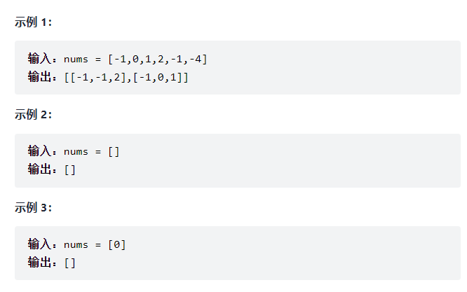
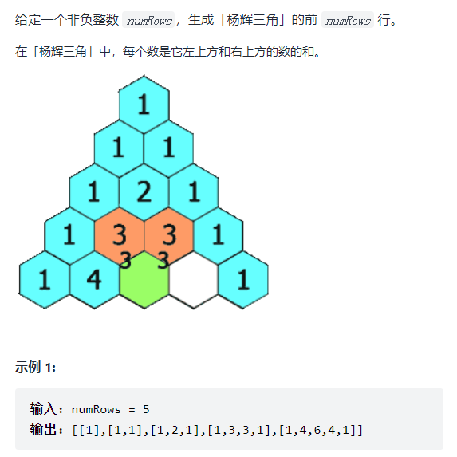
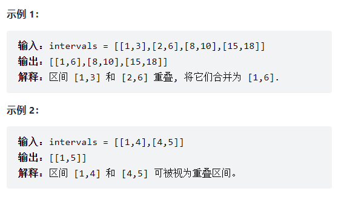
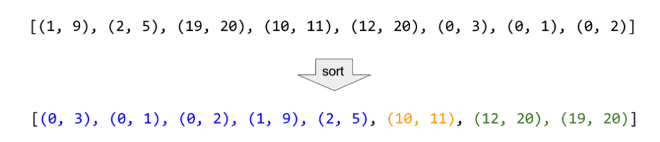
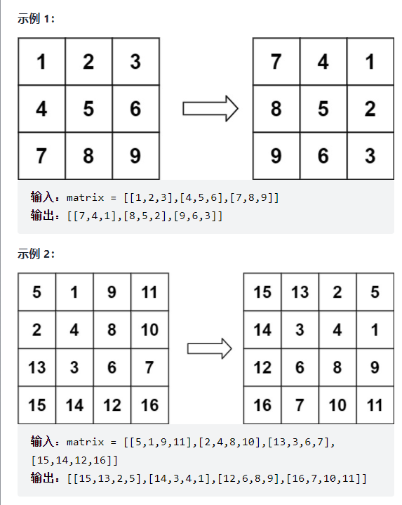
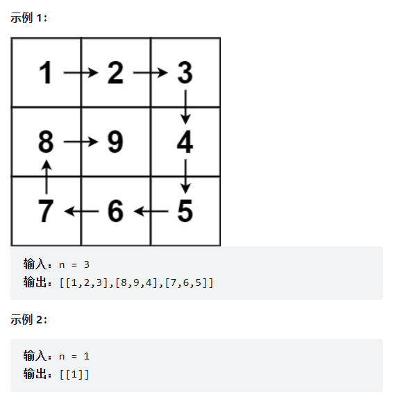
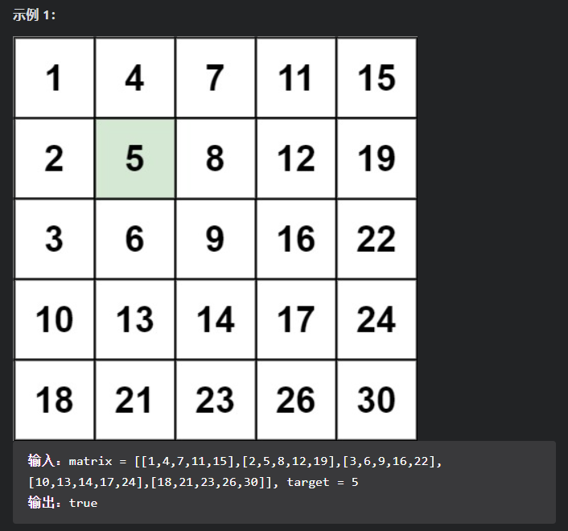
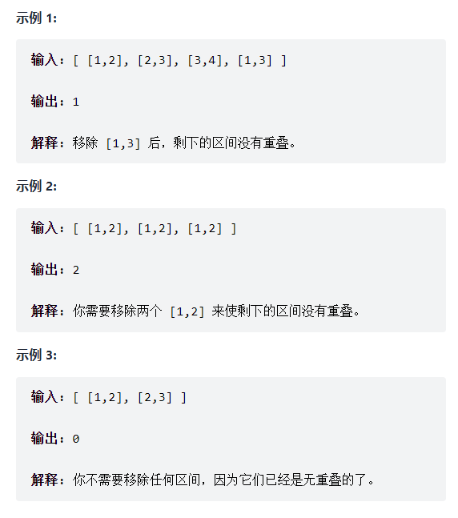

## 数组

### 217. 存在重复元素

**【代码】**

~~~java
class Solution {
    public boolean containsDuplicate(int[] nums) {
        HashSet<Integer> set = new HashSet<>();
        for(int x : nums){
            if(!set.add(x))
                return true;
        }
        return false;
    }
}
~~~

### 88.合并两个有序数组

【题目描述】：

​		给你两个按非递减顺序排列的整数数组 nums1 和 nums2，另有两个整数 m 和 n ，分别表示 nums1 和 nums2 中的元素数目。

​		请你合并nums2到nums1 中，使合并后的数组同样按 非递减顺序排列。

​		注意：最终，合并后数组不应由函数返回，而是存储在数组 nums1 中。为了应对这种情况，nums1 的初始长度为 m + n，其中前 m 个元素表示应合并的元素，后 n 个元素为 0 ，应忽略。nums2 的长度为 n 。

【思路】：

​		利用两个数组非递减顺序排列的性质，可以通过双指针对两个数组进行遍历。此外，可以发现数组nums1中后面包含额外的空间，可以直接将元素复制到nums1中，从而使空间复杂度达到O(1)。

【代码】：

~~~java
class Solution {
    public void merge(int[] nums1, int m, int[] nums2, int n) {
        int p1 = m-1, p2 = n-1, tail = m+n-1;
        int cur;

        while(p1 >= 0 || p2 >=0){
            if(p1 < 0){
                cur = nums2[p2--];
            }else if(p2 < 0){
                cur = nums1[p1--];
            }else if(nums1[p1] < nums2[p2]){
                cur = nums2[p2--];
            }else{
                cur = nums1[p1--];
            }

            nums1[tail--] = cur;
        }
    }
}
~~~

### 169. [多数元素](https://leetcode-cn.com/problems/majority-element/)

【题目描述】：

​		给定一个大小为 n 的数组，找到其中的多数元素。多数元素是指在数组中出现次数 大于 ⌊ n/2 ⌋ 的元素。

​		你可以假设数组是非空的，并且给定的数组总是存在多数元素。

【思路】：

- 通过哈希表对每个数字以及其出现的次数进行储存，然后对哈希表进行遍历，找出众数：

  ~~~java
  class Solution {
      public int majorityElement(int[] nums) {
          int n = nums.length;
          //构建哈希表
          HashMap<Integer, Integer> map = new HashMap<>();
          for(int num : nums){
              if(!map.containsKey(num)){
                  map.put(num, 1);
              }else{
                  map.put(num, map.get(num) + 1);
              }
          }
  
          //遍历哈希表，寻找众数
          for(HashMap.Entry<Integer, Integer> entry : map.entrySet()){
              if(entry.getValue() > n/2)
                  return entry.getKey();
          }
          return 0;
      }
  }
  ~~~

  时间复杂度$O(n)$, 空间复杂度$O(n)$；

- 快速排序，排序好数组的up [n/2]位置即为众数；

- 分治；

- **Boyer-Moore投票算法**，在该题的题解中提供的思路，其思路为：

  如果把众数记为+1，把其他数记为-1，并对所有数求和，其总和一定大于0，即众数的数量相比其他数更多。

  根据此思路，Boyer-Moore算法维护一个候选众数`candidate`和出现次数`count`。初始时，`count`的值为0。然后对于整个数组进行遍历，对其中的元素`x`，如果遍历到`x`时`count`为0，则将`x`作为`candidate`，并对`x`进行判断：

  - `x`与`candidate`相等，则`count`加1；
  - `x`与`candidate`不等，则`count`减1；

  在整个数组遍历完成后，`candidate`即为该数组的众数。

【代码】：

~~~java
class Solution {
    public int majorityElement(int[] nums) {
        int count = 0;
        Integer candidate = null;

        for(int num : nums){
            //确定候选众数
            if(count == 0){
                candidate = num;
            }

            count += (num == candidate) ? 1 : -1;
        }
        return candidate;
    }
}
~~~

### [15.三数之和](https://leetcode-cn.com/problems/3sum/submissions/)

【题目描述】：

​		给你一个包含 n 个整数的数组 nums，判断 nums 中是否存在三个元素 a，b，c ，使得 a + b + c = 0 ？请你找出所有和为 0 且不重复的三元组。

​		注意：答案中不可以包含重复的三元组。

【思路】：

​		**排序+双指针**，题目中要求答案中不能包含重复的三元组，因此如果想要通过直接的枚举，需要在每找到一组答案之后，与之前的答案进行比较，去除重复元素，这样的操作会造成很大额外的开销。为了能够更快速的判别，可以先对数组中的元素进行从小到大的排序，使找到的三元组(a,b,c)满足$a \leq b \leq c$，从而避免重复的枚举。需要注意，对于每一重循环而言，相邻两次枚举的元素不能相同，否则也会造成重复。

​		排序后，可以利用数组中元素从小到大的特性，采用双指针的方法进行遍历，将第三重循环变成一个从右向左遍历的指针，从而将整体的时间复杂度由$O(n^3)$​变为$O(N^2)$。

【代码】：

~~~java
class Solution {
    public List<List<Integer>> threeSum(int[] nums) {
        Arrays.sort(nums);
        List<List<Integer>> ans = new ArrayList<List<Integer>>();
        int len = nums.length;

        for(int first = 0; first < len; first++){
            if(first > 0 && nums[first] == nums[first-1]){
                continue;
            }

            int second = first+1;
            int third = len-1;
            int remain = -nums[first];
            int mark = Integer.MAX_VALUE;      //标记，防止相同数字重复遍历

            while(second < third){
                if(nums[second] + nums[third] < remain){
                    second += 1;
                }else if(nums[second] + nums[third] > remain){
                    third -= 1;
                }else{
                    if(nums[second] != mark){
                        List<Integer> curAns = new ArrayList<>();
                        curAns.add(nums[first]);
                        curAns.add(nums[second]);
                        curAns.add(nums[third]);
                        ans.add(curAns);
                        mark = nums[second];
                        second += 1;
                        third -= 1;
                    }else{
                        second += 1;
                    }
                    
                }
            }
        }
        return ans;
    }
}
~~~

### 18.杨辉三角

【题目描述】：

【代码】：

~~~java
class Solution {
    public List<List<Integer>> generate(int numRows) {
        List<List<Integer>> ans = new ArrayList<List<Integer>>();
        for(int i = 0; i < numRows; i++){
            List<Integer> row= new ArrayList<Integer>();
            for(int j = 0; j <= i; j++){
                if(j == 0 || j == i){
                    row.add(1);
                }else{
                    row.add(ans.get(i-1).get(j-1) + ans.get(i-1).get(j));
                }
            }
            ans.add(row);
        }
        return ans;
    }
}
~~~

### [56. 合并区间](https://leetcode-cn.com/problems/merge-intervals/)

【题目描述】：

​		以数组 intervals 表示若干个区间的集合，其中单个区间为 $intervals[i] = [start_i, end_i]$​ 。请你合并所有重叠的区间，并返回一个不重叠的区间数组，该数组需恰好覆盖输入中的所有区间。

【思路】：

​		对题目中给出的例子进行观察，两个区间如果能够进行合并，它们一定是相邻 / 与合并完区间相邻的。因此首先想到对区间进行排序，排序之后可以合并的区间一定是连续的。

​		排序之后，便可以对区间进行合并，用数组merged保存合并之后的区间，并将第一个区间添加到merged当中。对于后面的区间：

- 起点$>$上个区间终点，不会重合，可直接将其添加到merged中；
- 起点$\leq$​上个区间终点，区间重合，进行合并，合并后的终点为两个区间中较大的终点；

【代码】：

~~~java
class Solution {
    public int[][] merge(int[][] intervals) {
        int len = intervals.length;
        if(len == 0)    return new int[0][2];
        //对数组按左边界升序排序
        Arrays.sort(intervals, (v1, v2) -> v1[0] - v2[0]);
        //保存合并完区间
        List<int[]> merged = new ArrayList<int[]>();
        for(int i = 0; i < len; i++){
            int left = intervals[i][0], right = intervals[i][1];
            //merged为空或者区间未重合
            if(merged.size() == 0 || merged.get(merged.size()-1)[1] < left){
                merged.add(new int[]{left, right});
            }else{
                int bound = merged.get(merged.size() - 1)[1];
                bound = Math.max(bound, right);
                merged.get(merged.size() - 1)[1] = bound;
            }
        }
        return merged.toArray(new int[0][]);
    }
}
~~~

### [48.旋转图像](https://leetcode-cn.com/problems/rotate-image/)

【题目描述】：

​		给定一个 n × n 的二维矩阵 matrix 表示一个图像。请你将图像顺时针旋转 90 度。

​		你必须在 原地 旋转图像，这意味着你需要直接修改输入的二维矩阵。请不要 使用另一个矩阵来旋转图像。

【思路】：

### [59. 螺旋矩阵](https://leetcode-cn.com/problems/spiral-matrix-ii/)(day 3)

【题目描述】：

​		给你一个正整数 `n` ，生成一个包含 `1` 到 `n2` 所有元素，且元素按顺时针顺序螺旋排列的 `n x n` 正方形矩阵 `matrix` 。

【思路】：

​		模拟矩阵的生成过程，从左上角开始，向右进行生成。如果下个位置超出矩阵的边界 / 到达之前访问过的位置，则顺时针进行旋转，进入下一个方向，直到生成完毕。

​		为了使旋转的操作更为便捷，建立数组`dir = [[0, 1], [1, 0], [0, -1], [-1, 0]]`，记录下每个方向需要对数组下表进行的更新操作，可以更为快速的判断是否需要旋转以及更新下标。

【代码】：

~~~java
class Solution {
    public int[][] generateMatrix(int n) {
        int[][] matrix = new int[n][n];
        //方向:右、下、左、上
        int[][] dir = {{0, 1}, {1, 0}, {0, -1}, {-1, 0}};
        int dirIndex = 0;
        int curNum = 1;
        int row = 0, col = 0;

        while(curNum <= n*n){
            matrix[row][col] = curNum;
            curNum += 1;
            //按当前方向的下一组(row,col)
            int nextRow = row + dir[dirIndex][0], nextCol = col + dir[dirIndex][1];
            //判断是否需要转向
            if(nextRow < 0 || nextRow >= n || nextCol < 0 || nextCol >= n || matrix[nextRow][nextCol] != 0){
                dirIndex = (dirIndex + 1) % 4;
            }
            //更新下标
            row = row + dir[dirIndex][0]; col = col + dir[dirIndex][1];
        }

        return matrix;
    }
}
~~~

### [240.搜索二维矩阵](https://leetcode-cn.com/problems/search-a-2d-matrix-ii/)

【题目描述】：

编写一个高效的算法来搜索 m x n 矩阵 matrix 中的一个目标值 target 。该矩阵具有以下特性：

- 每行的元素从左到右升序排列；
- 每列的元素从上到下升序排列；

【思路】：

- 对每行进行二分搜索；

- 通过对二维数组的进一步观察，可以发现数组从左到右、从上到下都是递增的，即每次都是向左数字会变小，向下数字会变大，有点和二分查找树相似。

  因此，可以从右上角进行遍历，

  - 如果当前值小于`target`，就向左走，`col--`；
  - 如果当前值大于`target`，就向右走，`row++`；
  - 当前值等于`target`，则返回`true`；

  直到遍历出数组边界，返回`false`。

  该方法可以将时间复杂度缩减为$O(max(m,n))$.

【代码】：

~~~java
class Solution {
    public boolean searchMatrix(int[][] matrix, int target) {
        int m = matrix.length, n = matrix[0].length;
        int row = 0, col = n-1;
        //从右上角搜索矩阵
        while(row < m && col >= 0){
            if(matrix[row][col] < target){
                row += 1;
            }else if(matrix[row][col] > target){
                col -= 1;
            }else{
                return true;
            }
        }
        return false;
    }
}
~~~

### [435. 无重叠区间]()

【题目描述】：

​		给定一个区间的集合，找到需要移除区间的最小数量，使剩余区间互不重叠。

​		注意:

- 可以认为区间的终点总是大于它的起点。
- 区间 [1,2] 和 [2,3] 的边界相互“接触”，但没有相互重叠。

【思路】：排序+贪心

我们不妨想一想应该选择哪一个区间作为首个区间。

 ，即区间 jj 的右端点在区间 kk 的左侧，那么我们将区间 kk 替换为区间 jj，其与剩余右侧被选择的区间仍然是不重叠的。而当我们将区间 kk 替换为区间 jj 后，就得到了另一种最优的选择方法。

我们可以不断地寻找右端点在首个区间右端点左侧的新区间，将首个区间替换成该区间。那么当我们无法替换时，首个区间就是所有可以选择的区间中右端点最小的那个区间。因此我们将所有区间按照右端点从小到大进行排序，那么排完序之后的首个区间，就是我们选择的首个区间。

如果有多个区间的右端点都同样最小怎么办？由于我们选择的是首个区间，因此在左侧不会有其它的区间，那么左端点在何处是不重要的，我们只要任意选择一个右端点最小的区间即可。

当确定了首个区间之后，所有与首个区间不重合的区间就组成了一个规模更小的子问题。由于我们已经在初始时将所有区间按照右端点排好序了，因此对于这个子问题，我们无需再次进行排序，只要找出其中与首个区间不重合并且右端点最小的区间即可。用相同的方法，我们可以依次确定后续的所有区间。

【代码】：

~~~java
class Solution {
    public int eraseOverlapIntervals(int[][] intervals) {
        int len = intervals.length;
        Arrays.sort(intervals, (v1, v2) -> v1[1] - v2[1]);

        int boundary = Integer.MIN_VALUE;	//当前右边界
        int select = 0;

        for(int i = 0; i < len; i++){
            //区间为重合，则更新右边界
            if(intervals[i][0] >= boundary){
                select += 1;
                boundary = intervals[i][1];
            }
        }

        return len-select;
    }
}
~~~

~~~java
//从小到大排序，外排序，多路归并
public class LoserTree {
    int[] losers;//败者树（堆）0位置为胜者后面都是败者
    List<Queue<Integer>> items;//队列模拟待取的n个文件
    int size;//多少路排序，items的数量
    int hasItemSize;//多少个队列没取完
    public LoserTree(List<Queue<Integer>> items){
        this.items = items;
        size = items.size();
        losers = new int[items.size()];
        Arrays.fill(losers,-1);
        hasItemSize = size;
        //首次，需要把所有数都装进去
        for(int i = 0; i < size; i++){
            sort(i);
        }
    }

    //当前排列的胜者
    public int findWinner(){
        return items.get(losers[0]).peek();
    }

    private void sort(){
        //胜者离开，把下一个元素加进去
        items.get(losers[0]).poll();
        if(items.get(losers[0]).isEmpty()){
            --hasItemSize;
        }
        if(hasItem()){
            sort(losers[0]);
        }
    }

    private void sort(int i){
        //堆排但是不直接排序，只记录比较中败者，胜者继续走上父节点
        int j = (i+size)/2;
        int itemIndex = i;
        while(j > 0 && itemIndex>=0){
            int itemValue = getIndexVal(itemIndex);
            int parentVal =  getIndexVal(losers[j]);
            if(losers[j]==-1 || parentVal<itemValue){
                int temp = itemIndex;
                itemIndex = losers[j];
                losers[j] = temp;
                itemValue = getIndexVal(itemIndex);
            }

            //赢家做首个点
            if(losers[0]==-1 || itemValue<getIndexVal(losers[0])){
                losers[0] = itemIndex;
            }
            j=j/2;

        }
    }

    private int getIndexVal(int index){
        //没填过或者无值的自动采用最大值，使其成为败者
        return index==-1 || items.get(index).isEmpty()?Integer.MAX_VALUE:items.get(index).peek();
    }

    private boolean hasItem(){
        return hasItemSize>0;
    }

    public static void main(String[] args) {
        //假设当前有 4 个归并段
        Queue<Integer> queue0 = new LinkedList<>();
        Queue<Integer> queue1 = new LinkedList<>();
        Queue<Integer> queue2 = new LinkedList<>();
        Queue<Integer> queue3 = new LinkedList<>();
        //注意，这里队列模仿的小文件已经是有序
        Integer[] source0 = {2, 8, 16, 23, 26};
        Integer[] source1 = {4, 13, 22, 23, 29};
        Integer[] source2 = {5, 12, 15, 23, 32};
        Integer[] source3 = {3, 7, 17, 23, 28};
        queue0.addAll(Arrays.asList(source0));
        queue1.addAll(Arrays.asList(source1));
        queue2.addAll(Arrays.asList(source2));
        queue3.addAll(Arrays.asList(source3));

        LoserTree loserTree = new LoserTree(Arrays.asList(queue0,queue1,queue2,queue3));
        while(loserTree.hasItem()){
            //输出胜者
            System.out.println(loserTree.findWinner());
            //移动，找出下一个胜者
            loserTree.sort();
        }
    }
}
~~~

