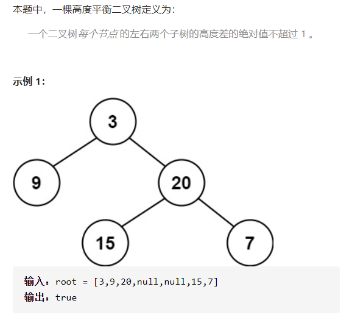
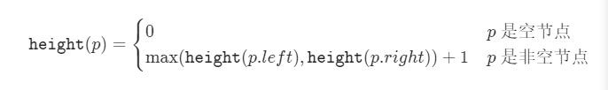
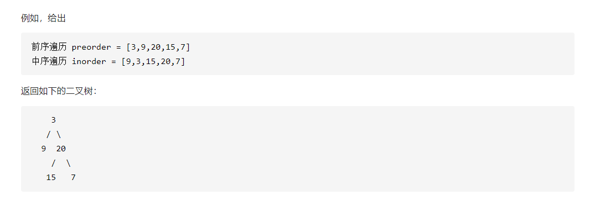

## 树

### 二叉树结构类型

~~~java
public class TreeNode {
    int val;
    TreeNode left;
    TreeNode right;
    TreeNode() {}
    TreeNode(int val) { this.val = val;     
    TreeNode(int val, TreeNode left, TreeNode right) {
        this.val = val;
        this.left = left;
        this.right = right; 
     }
}
~~~

### 101.平衡二叉树（easy）

【题目说明】：给定一个二叉树，判断其是否为高度平衡二叉树。

【解答】：

​		（1）自顶向下的递归——$O(n^2)$

​		（2）自底向上的递归：定义函数**height**，用于计算二叉树中任一节点$p$的高度。

​		由于自顶向下的递归，对于同一个节点，函数height会被重复调用，导致时间复杂度较高；而自底向上的做法对每个节点，函数height只会被调用一次。

​			自底向上递归的做法类似于后序遍历，对于当前遍历到的节点，先递归地判断其左右子树是否平衡，再判断以当前节点为根的子树是否平衡。如果一棵子树是平衡的，则返回其高度（高度一定是非负整数），否则返回 −1。如果存在一棵子树不平衡，则整个二叉树一定不平衡。

​		递归操作：1）终止条件；2）返回值；3）单步操作；

【代码】：

~~~java
class Solution {
    public boolean isBalanced(TreeNode root) {
        return height(root) >= 0;
    }

    public int height(TreeNode root){
        if(root == null){
            return 0;
        }
        int leftHeight = height(root.left);
        int rightHeight = height(root.right);
        if(leftHeight == -1 || rightHeight == -1 || Math.abs(leftHeight-rightHeight) > 1){
            return -1;
        }else{
            return Math.max(leftHeight, rightHeight) + 1;
        }
    }
}
~~~

### 剑指offer 07. 重构二叉树

【题目说明】：

​		输入某二叉树的前序遍历和中序遍历的结果，请重建该二叉树。假设输入的前序遍历和中序遍历的结果中都不含重复的数字。

【解答】：

​		前序遍历的性质：节点按照【根节点 | 左子树 | 右子树】排序；

​		中序遍历的性质：节点按照【左子树 | 根节点 | 右子树】排序；

​		根据前序遍历以及中序遍历的性质，可以通过下面的步骤进行划分：

- 前序遍历中的首元素为根节点`node`的值；
- 在中序遍历中搜索根节点`node`的索引，可将中序遍历划分为`[left | root | right]`；
- 根据中序遍历中的左(右)子树的节点数量，可将前序遍历划分为`[root | left | right]`；

​		通过以上的步骤，可以确定3个节点：1）树的根节点；2）左子树根节点；3）右子树根节点；之后采用递归的方式再对左右子树进行划分。

【代码】：

~~~java
class Solution {
    int[] preorder;
    HashMap<Integer, Integer> dic = new HashMap<>();
    
    public TreeNode buildTree(int[] preorder, int[] inorder) {
        this.preorder = preorder;
        for(int i = 0; i < inorder.length; i++)
            dic.put(inorder[i], i);
        return recur(0, 0, inorder.length - 1);
    }
    
    TreeNode recur(int root, int left, int right) {
        if(left > right) return null;                          // 递归终止
        TreeNode node = new TreeNode(preorder[root]);          // 建立根节点
        int i = dic.get(preorder[root]);                       // 划分根节点、左子树、右子树
        node.left = recur(root + 1, left, i - 1);              // 开启左子树递归
        node.right = recur(root + i - left + 1, i + 1, right); // 开启右子树递归
        return node;                                           // 回溯返回根节点
    }
}
~~~

