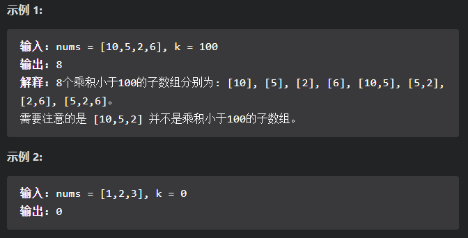
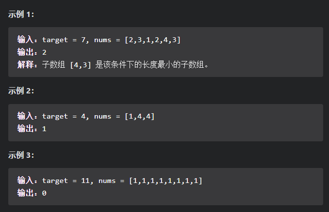

## 滑动窗口

#### [713. 乘积小于K的子数组](https://leetcode-cn.com/problems/subarray-product-less-than-k/)

​		给定一个正整数数组 `nums`和整数 `k` 。请找出该数组内乘积小于 `k` 的连续的子数组的个数。

【代码】：

~~~java
class Solution {
    public int numSubarrayProductLessThanK(int[] nums, int k) {
        //boundary condition
        if(k <= 1)  return 0;
        int left = 0, ans = 0, prod = 1;
        //slide window, expand the right boundary while prod<k
        //and narrow left boundary when prod>=k
        for(int right = 0; right < nums.length; right++){
            prod *= nums[right];
            while(prod >= k){
                prod /= nums[left];
                left += 1;
            }
            //the numver of subarrays in the current window
            ans += right - left + 1;
        }
        return ans;
    }
}
~~~

#### [209. 长度最小的子数组](https://leetcode-cn.com/problems/minimum-size-subarray-sum/)

​		给定一个含有 n 个正整数的数组和一个正整数 target 。

​		找出该数组中满足其和 ≥ target 的长度最小的 连续子数组` [numsl, numsl+1, ..., numsr-1, numsr]`，并返回其长度。如果不存在符合条件的子数组，返回 0 。

【代码】：

~~~java
class Solution {
    public int minSubArrayLen(int target, int[] nums) {
        int left = 0, sum = 0, curMin = Integer.MAX_VALUE;
        //expand right, and calculate array length when sum>=target
        //narrow left, until sum<target
        for(int right = 0; right < nums.length; right++){
            sum += nums[right];
            while(sum >= target){
                int curLen = right - left + 1;
                curMin = Math.min(curLen, curMin);
                sum -= nums[left];
                left += 1;
            }
        }
        return curMin == Integer.MAX_VALUE ? 0 : curMin;
    }
}
~~~

