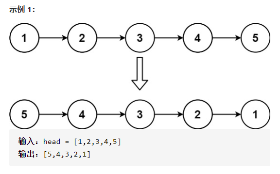
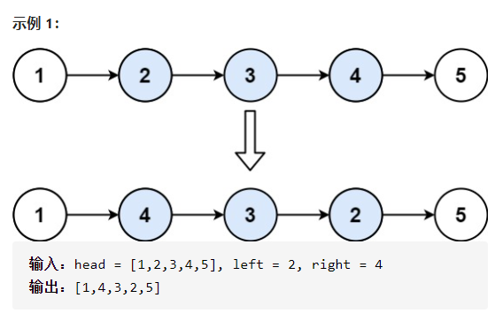
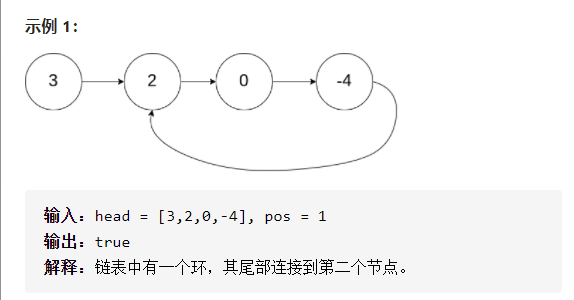
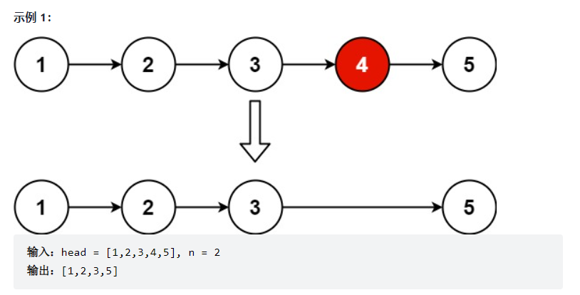
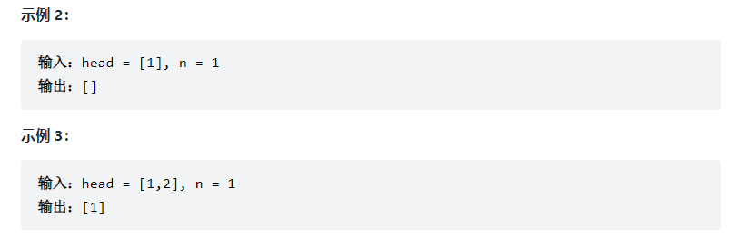

## 链表

### 206.反转列表

【题目描述】：

​		给你单链表的头节点 `head` ，请你反转链表，并返回反转后的链表。

【代码】：

- 迭代

~~~java
class Solution {
    public ListNode reverseList(ListNode head) {
        ListNode pre = null;    //前指针节点
        ListNode curr = head;   //当前指针节点
        //将节点指向其前面的节点，指针后移
        while(curr != null){
            ListNode tmp = curr.next;
            curr.next = pre;
            pre = curr;
            curr = tmp;
        }
        return pre;
    }
}
~~~

- 递归

~~~java
class Solution{
    public ListNode reverseList(ListNode head){
        recur(head, null);
    }
    
    private ListNode recur(ListNode cur, ListNode pre){
        //递归终止
        if(cur == null)	return pre;
        ListNode res = recur(cur.next, cur);
        cur.next = pre;
        return res;
    }
}
~~~

### 92.反转链表II

【题目描述】：

​		给你单链表的头指针 head 和两个整数 left 和 right ，其中 left <= right 。请你反转从位置 left 到位置 right 的链表节点，返回 反转后的链表 。

【解答】：

​		首先锁定链表需要进行反转的位置，找到左边界left。为了减少循环的次数，可以在遍历链表的同时，采用头插法对节点进行交换。每遍历到一个节点，让这个新节点来到反转部分的起始位置。

​		使用三个指针变量 pre、curr、next 来记录反转的过程中需要的变量，它们的意义如下：

- curr：指向待反转区域的第一个节点 left；
- next：永远指向 curr 的下一个节点，循环过程中，curr 变化以后 next 会变化；
- pre：永远指向待反转区域的第一个节点 left 的前一个节点，在循环过程中不变。

​		操作步骤：

- 先将 curr 的下一个节点记录为 next；
- 执行操作 ①：把 curr 的下一个节点指向 next 的下一个节点；
- 执行操作 ②：把 next 的下一个节点指向 pre 的下一个节点；
- 执行操作 ③：把 pre 的下一个节点指向 next。

【代码】：

~~~java
class Solution {
    public ListNode reverseBetween(ListNode head, int left, int right) {
        //设置一个空链表dummyNode
        ListNode dummyNode = new ListNode(-1);
        dummyNode.next = head;
        ListNode pre = dummyNode;
        for(int i=1; i<left; i++){
            pre = pre.next;
        }
        ListNode cur = pre.next;
        ListNode next;
        for(int i=left; i<right; i++){
            next = cur.next;
            cur.next = next.next;
            next.next = pre.next;
            pre.next = next;
        }
        return dummyNode.next;
    }
}
~~~

### [141.环形链表](https://leetcode-cn.com/problems/linked-list-cycle/)

【题目】：

​		给定一个链表，判断链表中是否有环。

​		如果链表中有某个节点，可以通过连续跟踪 next 指针再次到达，则链表中存在环。 为了表示给定链表中的环，我们使用整数 pos 来表示链表尾连接到链表中的位置（索引从 0 开始）。 如果 pos 是 -1，则在该链表中没有环。注意：pos 不作为参数进行传递，仅仅是为了标识链表的实际情况。

​		如果链表中存在环，则返回 true 。 否则，返回 false 。

【解题思路】：

1. 哈希表

2. 快慢指针

   假想「乌龟」和「兔子」在链表上移动，「兔子」跑得快，「乌龟」跑得慢。当「乌龟」和「兔子」从链表上的同一个节点开始移动时，如果该链表中没有环，那么「兔子」将一直处于「乌龟」的前方；如果该链表中有环，那么「兔子」会先于「乌龟」进入环，并且一直在环内移动。等到「乌龟」进入环时，由于「兔子」的速度快，它一定会在某个时刻与乌龟相遇，即套了「乌龟」若干圈。

   我们可以根据上述思路来解决本题。具体地，我们定义两个指针，一快一满。慢指针每次只移动一步，而快指针每次移动两步。初始时，慢指针在位置 head，而快指针在位置 head.next。这样一来，如果在移动的过程中，快指针反过来追上慢指针，就说明该链表为环形链表。否则快指针将到达链表尾部，该链表不为环形链表。

【代码】：

~~~java
public class Solution {
    public boolean hasCycle(ListNode head) {
        if (head == null || head.next == null) {
            return false;
        }
        ListNode slow = head;
        ListNode fast = head.next;
        while (slow != fast) {
            if (fast == null || fast.next == null) {
                return false;
            }
            slow = slow.next;
            fast = fast.next.next;
        }
        return true;
    }
}
~~~

### 19.删除链表的倒数第n个结点

【题目描述】：

​		给你一个链表，删除链表的倒数第 `n` 个结点，并且返回链表的头结点。

【解题思路】：

​		

【代码】：

~~~java
class Solution {
    public ListNode removeNthFromEnd(ListNode head, int n) {
        //创建dummy node，指向head
        ListNode dummy = new ListNode(0, head);
        ListNode slow = dummy, fast = head;
        //快指针先n位移动
        for(int i = 0; i < n; i++){
            fast = fast.next;
        }

        while(fast != null){
            slow = slow.next;
            fast = fast.next;
        }
        slow.next = slow.next.next;
        ListNode ans = dummy.next;
        return ans;
    }
}
~~~

