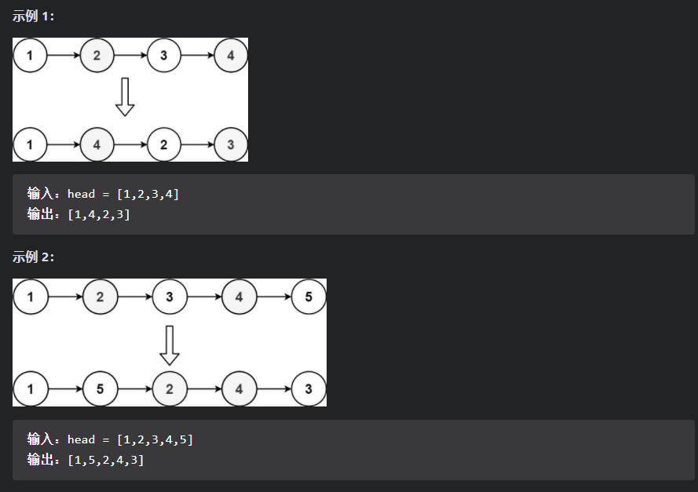
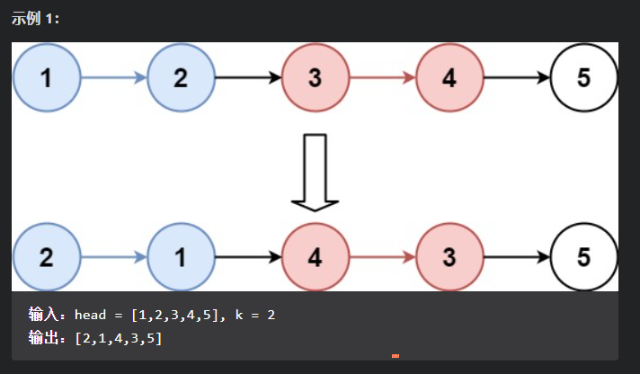

## 链表

### [707.设计链表](https://leetcode-cn.com/problems/design-linked-list/)

【题目描述】：

​		设计链表的实现。您可以选择使用单链表或双链表。单链表中的节点应该具有两个属性：val 和 next。val 是当前节点的值，next 是指向下一个节点的指针/引用。如果要使用双向链表，则还需要一个属性 prev 以指示链表中的上一个节点。假设链表中的所有节点都是 0-index 的。

在链表类中实现这些功能：

- `get(index)`：获取链表中第 index 个节点的值。如果索引无效，则返回-1；
- `addAtHead(val)`：在链表的第一个元素之前添加一个值为 val 的节点。插入后，新节点将成为链表的第一个节点。
- `addAtTail(val)`：将值为 val 的节点追加到链表的最后一个元素。
- `addAtIndex(index,val)`：在链表中的第 index 个节点之前添加值为 val  的节点。如果 index 等于链表的长度，则该节点将附加到链表的末尾。如果 index 大于链表长度，则不会插入节点。如果index小于0，则在头部插入节点。
- `deleteAtIndex(index)`：如果索引 index 有效，则删除链表中的第 index 个节点。

【思路】：

【代码】：

- 单链表

  ~~~java
  class MyLinkedList {
      private int size;
      private ListNode head;
  
      public MyLinkedList() {
          size = 0;
          head = new ListNode(0);
      }
      
      public int get(int index) {
          //index must be more than size because the exist of senital
          if(index < 0 || index >= size){
              return -1;
          }
  
          ListNode cur = head;
          for(int i = 0; i < index+1; i++){
              cur = cur.next;
          }
          return cur.val;
      }
      
      public void addAtHead(int val) {
          addAtIndex(0, val);
      }
      
      public void addAtTail(int val) {
          addAtIndex(size, val);
      }
      
      public void addAtIndex(int index, int val) {
         if(index < 0 || index > size)
              return;
          
          //find the predecessor of the added node
          ListNode pred = head;
          for(int i = 0; i < index; i++){
              pred = pred.next;
          }
          ListNode toAdd = new ListNode(val);
          toAdd.next = pred.next;
          pred.next = toAdd;
          size += 1;
      }
      
      public void deleteAtIndex(int index) {
          if(index < 0 || index >= size)
              return;
          
          ListNode pred = head;
          for(int i = 0; i < index; i++){
              pred = pred.next;
          }
          pred.next = pred.next.next;
          size -= 1;
      }
  }
  ~~~

  

### 206.反转列表

【题目描述】：

​		给你单链表的头节点 `head` ，请你反转链表，并返回反转后的链表。

【代码】：

- 迭代

~~~java
class Solution {
    public ListNode reverseList(ListNode head) {
        ListNode pre = null;    //前指针节点
        ListNode curr = head;   //当前指针节点
        //将节点指向其前面的节点，指针后移
        while(curr != null){
            ListNode tmp = curr.next;
            curr.next = pre;
            pre = curr;
            curr = tmp;
        }
        return pre;
    }
}
~~~

- 递归

~~~java
class Solution{
    public ListNode reverseList(ListNode head){
        recur(head, null);
    }
    
    private ListNode recur(ListNode cur, ListNode pre){
        //递归终止
        if(cur == null)	return pre;
        ListNode res = recur(cur.next, cur);
        cur.next = pre;
        return res;
    }
}
~~~

### 92.反转链表II

【题目描述】：

​		给你单链表的头指针 head 和两个整数 left 和 right ，其中 left <= right 。请你反转从位置 left 到位置 right 的链表节点，返回 反转后的链表 。

【解答】：

​		首先锁定链表需要进行反转的位置，找到左边界left。为了减少循环的次数，可以在遍历链表的同时，采用头插法对节点进行交换。每遍历到一个节点，让这个新节点来到反转部分的起始位置。

​		使用三个指针变量 pre、curr、next 来记录反转的过程中需要的变量，它们的意义如下：

- curr：指向待反转区域的第一个节点 left；
- next：永远指向 curr 的下一个节点，循环过程中，curr 变化以后 next 会变化；
- pre：永远指向待反转区域的第一个节点 left 的前一个节点，在循环过程中不变。

​		操作步骤：

- 先将 curr 的下一个节点记录为 next；
- 执行操作 ①：把 curr 的下一个节点指向 next 的下一个节点；
- 执行操作 ②：把 next 的下一个节点指向 pre 的下一个节点；
- 执行操作 ③：把 pre 的下一个节点指向 next。

【代码】：

~~~java
class Solution {
    public ListNode reverseBetween(ListNode head, int left, int right) {
        //设置一个空链表dummyNode
        ListNode dummyNode = new ListNode(-1);
        dummyNode.next = head;
        ListNode pre = dummyNode;
        for(int i=1; i<left; i++){
            pre = pre.next;
        }
        ListNode cur = pre.next;
        ListNode next;
        for(int i=left; i<right; i++){
            next = cur.next;
            cur.next = next.next;
            next.next = pre.next;
            pre.next = next;
        }
        return dummyNode.next;
    }
}
~~~

### [141.环形链表](https://leetcode-cn.com/problems/linked-list-cycle/)

【题目】：

​		给定一个链表，判断链表中是否有环。

​		如果链表中有某个节点，可以通过连续跟踪 next 指针再次到达，则链表中存在环。 为了表示给定链表中的环，我们使用整数 pos 来表示链表尾连接到链表中的位置（索引从 0 开始）。 如果 pos 是 -1，则在该链表中没有环。注意：pos 不作为参数进行传递，仅仅是为了标识链表的实际情况。

​		如果链表中存在环，则返回 true 。 否则，返回 false 。

【解题思路】：

1. 哈希表

2. 快慢指针

   假想「乌龟」和「兔子」在链表上移动，「兔子」跑得快，「乌龟」跑得慢。当「乌龟」和「兔子」从链表上的同一个节点开始移动时，如果该链表中没有环，那么「兔子」将一直处于「乌龟」的前方；如果该链表中有环，那么「兔子」会先于「乌龟」进入环，并且一直在环内移动。等到「乌龟」进入环时，由于「兔子」的速度快，它一定会在某个时刻与乌龟相遇，即套了「乌龟」若干圈。

   我们可以根据上述思路来解决本题。具体地，我们定义两个指针，一快一满。慢指针每次只移动一步，而快指针每次移动两步。初始时，慢指针在位置 head，而快指针在位置 head.next。这样一来，如果在移动的过程中，快指针反过来追上慢指针，就说明该链表为环形链表。否则快指针将到达链表尾部，该链表不为环形链表。

【代码】：

~~~java
public class Solution {
    public boolean hasCycle(ListNode head) {
        if (head == null || head.next == null) {
            return false;
        }
        ListNode slow = head;
        ListNode fast = head.next;
        while (slow != fast) {
            if (fast == null || fast.next == null) {
                return false;
            }
            slow = slow.next;
            fast = fast.next.next;
        }
        return true;
    }
}
~~~

### 19.删除链表的倒数第n个结点

【题目描述】：

​		给你一个链表，删除链表的倒数第 `n` 个结点，并且返回链表的头结点。

【解题思路】：

​		

【代码】：

~~~java
class Solution {
    public ListNode removeNthFromEnd(ListNode head, int n) {
        //创建dummy node，指向head
        ListNode dummy = new ListNode(0, head);
        ListNode slow = dummy, fast = head;
        //快指针先n位移动
        for(int i = 0; i < n; i++){
            fast = fast.next;
        }

        while(fast != null){
            slow = slow.next;
            fast = fast.next;
        }
        slow.next = slow.next.next;
        ListNode ans = dummy.next;
        return ans;
    }
}
~~~

### [143. 重排链表]()

【题目描述】：

​		给定一个单链表 L 的头节点 head ，单链表 L 表示为：

~~~
L0 → L1 → … → Ln - 1 → Ln
~~~

​		请将其重新排列后变为：

~~~
L0 → Ln → L1 → Ln - 1 → L2 → Ln - 2 → …
~~~

​		不能只是单纯的改变节点内部的值，而是需要实际的进行节点交换。

【思路】：

1. 采用线性表存储，可以直接取出目标位置的节点；

2. 题目中需要分别从头节点和尾节点处遍历链表，但由于单链表无法从直接后向前遍历，因此想到将链表从中间拆分成前后两个链表，并将后面的链表反转，之后再将两个链表按顺序进行合并，即可得到题目中要求的结果。

   可以将这些需求拆分成3个功能函数进行实现：

   - `ListNode findMidNode(ListNode head)`：通过快慢指针对数组进行遍历，最终慢指针指向的即为链表的终点；
   - `ListNode reverse(ListNode head)`：对链表进行翻转；
   - `void mergeList(ListNode head1, ListNode head2)`：对两个链表按顺序进行合并；

【代码】：

~~~java
class Solution {
    public void reorderList(ListNode head) {
        // ListNode dummy = new ListNode(0);
        // dummy.next = head;
        ListNode mid = findMidNode(head);
        ListNode l1 = head;
        ListNode l2 = mid.next;
        mid.next = null;
        l2 = reverse(l2);
        mergeList(l1, l2);
    }

    //寻找链表中点
    private ListNode findMidNode(ListNode head){
        ListNode slow = head, fast = head;
        while(fast.next != null && fast.next.next != null){
            slow = slow.next;
            fast = fast.next.next;
        }
        return slow;
    }

    //反转链表
    private ListNode reverse(ListNode head){
        ListNode prev = null, cur = head;
        while(cur != null){
            ListNode tmp = cur.next;
            cur.next = prev;
            prev = cur;
            cur = tmp;
        }
        return prev;
    }

    //按顺序合并两个链表
    private void mergeList(ListNode head1, ListNode head2){
        ListNode tmp1, tmp2;
        while(head1 != null && head2 != null){
            tmp1 = head1.next;
            tmp2 = head2.next;

            head1.next = head2;
            head2.next = tmp1;
            head1 = tmp1;
            head2 = tmp2;
        }
    }
}
~~~

### [25. K个一组翻转链表](https://leetcode-cn.com/problems/reverse-nodes-in-k-group/)

【题目描述】：

​		给你一个链表，每 k 个节点一组进行翻转，请你返回翻转后的链表。

​		k 是一个正整数，它的值小于或等于链表的长度。如果节点总数不是 k 的整数倍，那么请将最后剩余的节点保持原有顺序。

【思路】：

​		

【代码】：

~~~java
class Solution {
    public ListNode reverseKGroup(ListNode head, int k) {
        ListNode dummy = new ListNode(0);
        dummy.next = head;
        ListNode pre = dummy;

        while(head != null){
            ListNode tail = pre;
            for(int i = 0; i < k; i++){
                tail = tail.next;
                //循环未结束时遍历完链表，直接返回结果
                if(tail == null){
                    return dummy.next;
                }
            }
            ListNode post = tail.next;
            ListNode[] reverse = reverseList(head, tail);
            head = reverse[0];
            tail = reverse[1];
            //将反转后的子链接回链表
            pre.next = head;
            tail.next = post;
            pre = tail;
            head = tail.next;
        }
        return dummy.next;
    }

    private ListNode[] reverseList(ListNode head, ListNode tail){
        ListNode pre = tail.next, cur = head;
        while(pre != tail){
            ListNode tmp = cur.next;
            cur.next = pre;
            pre = cur;
            cur = tmp;
        }
        return new ListNode[]{tail, head};
    }
}
~~~

